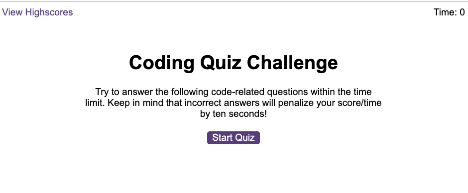

# Code Quiz

A timed quiz on JavaScript fundamentals that stores high scores.

## Description

The project represents an timed quiz game application that includes four question on JavaScript fundamentals with four multiple choice answers.

Once the user taps on "Start Quiz":

- A timer of 60 seconds starts counting
- The user is presented with the first question
- Once a question is answered, the users receives feedback on whether the answer is right or wrong
- If a question is answered incorrectly, time is subtracted from the clock
- The game ends when the timer reaches 0
- Once the game is over, the user can save his/her initials and score, review a list of previous scores, or clear all scores

## Usage

The webpage can be accessed using this URL: link to follow

To start the quiz, the user can tap on the button "Start Quiz".

The screenshot below displays an overview of the application.

## Credits

The project was built following the instructions from the materials in the Skills Bootcamp in Front-End Web Development by edX.

In addition, the following resources were used:

1. Content of bootcamp: exercises on timers and event listeners
2. Tutoring session to hide a section and display another section, logic to get the clicked answer
3. YouTube Tutorial: [JavaScript DOM Manipulation – Full Course for Beginners](https://www.youtube.com/watch?v=5fb2aPlgoys)
4. Blog article: [How to structure your JavaScript code into different files?](https://medium.com/@somaia_khalil/how-to-structure-your-javascript-code-into-different-files-21034102c7f3)
5. Markdown badges from [ileriayo](https://github.com/Ileriayo/markdown-badges?tab=readme-ov-file#markdown-badges)

## License

This project is licensed under the terms of the MIT license.

## Badges

